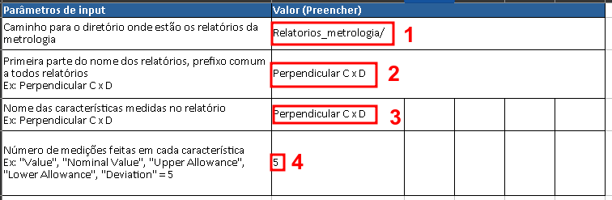
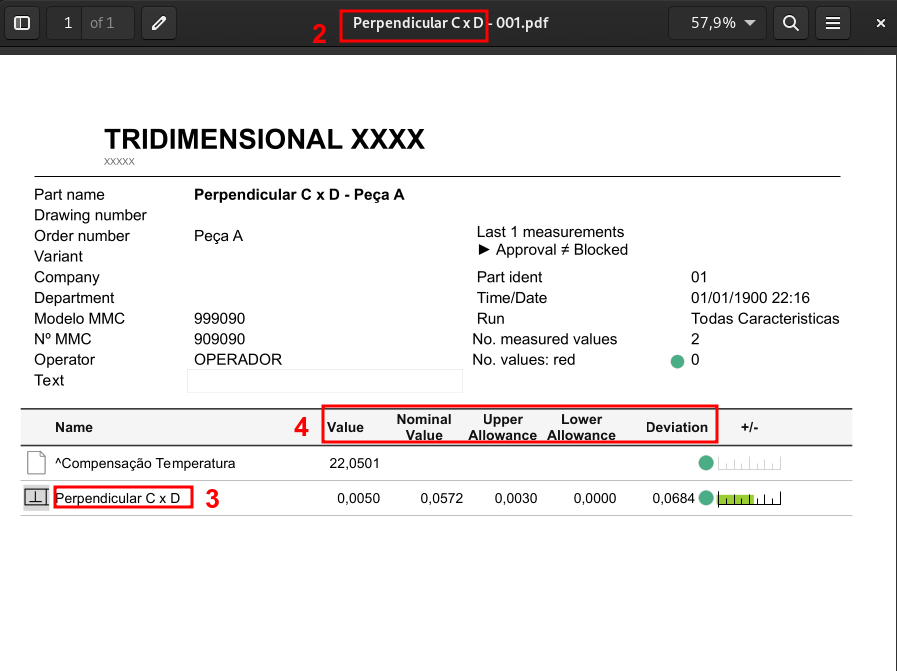

# Metrology-to-Excel
Script que coleta dados de relatório em PDF da metrologia e exporta para uma planilha em Excel. Desenvolvido no estágio de engenharia da qualidade na Tecumseh.

## Contexto 
Em processos de produção industrial é comum que áreas de Engenharia de produto e Engenharia da qualidade façam análises estátisticas com dimesões de peças.
As análises consistem em medir um grande número de peças (cerca de 50 peças) em máquinas da metrologia, como MCC e perfilómetro. Essas máquinas geram um relatório em PDF de cada peça com as dimensões e as características medidas. Cabe, então, ao time de engenharia abrir cada relatório, copiar os valores de interesse para uma planilha e em seguida fazer a análise estatística.
O programa automatiza esse processo de planilhar os valores dos relatórios, tornando uma tarefa que levaria cerca de 2 horas em uma tarefa de 10 minutos. 

## Requisitos
 - Python 3
 - pip
 - bibliotecas Python em _requirements.txt_

## Como instalar (Windows)
1. Baixar e fazer instalação padrão do [Python](https://www.python.org/ftp/python/3.10.6/python-3.10.6-amd64.exe).
2. Abrir o prompt de comando e dar o comando: `py -m pip install -r requirements.txt`.

## Como rodar
1. Abrir a planilha _get-data.xlsx_ e editar as variáveis da coluna "Valor (Preencher)" da aba Input.
2. Salvar e fechar a planilha.
3. Rodar o script _metrologia-to-excel.py_.
4. Abrir a planilha de "get_data.xlsx" e copiar os dados de interesse na nova aba.

## Exemplo
No diretório _Relatrios-metrologia_ há 20 exemplos de relatórios ficitícios para serem usados como exemplo.

### Como preencher a _get-data.xlsx_
Valor 1: Caminho para o diretório onde estão os relatórios da metrologia.

Valor 2: Prefixo do nome dos relatórios. Deve ser comum a todos os relatorios que se deseja ler.

Valor 3: Nome das características medidas no relatório, pode ser mais de uma.

Valor 4: Número de medições feitas em cada característica. Caso queira medir só o valor coloque 1, para todas as medidas coloque 5.

